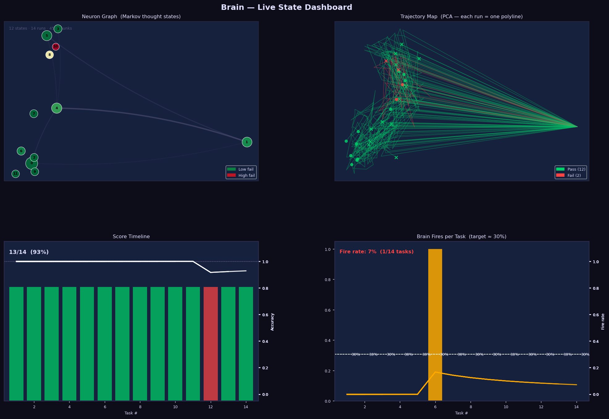
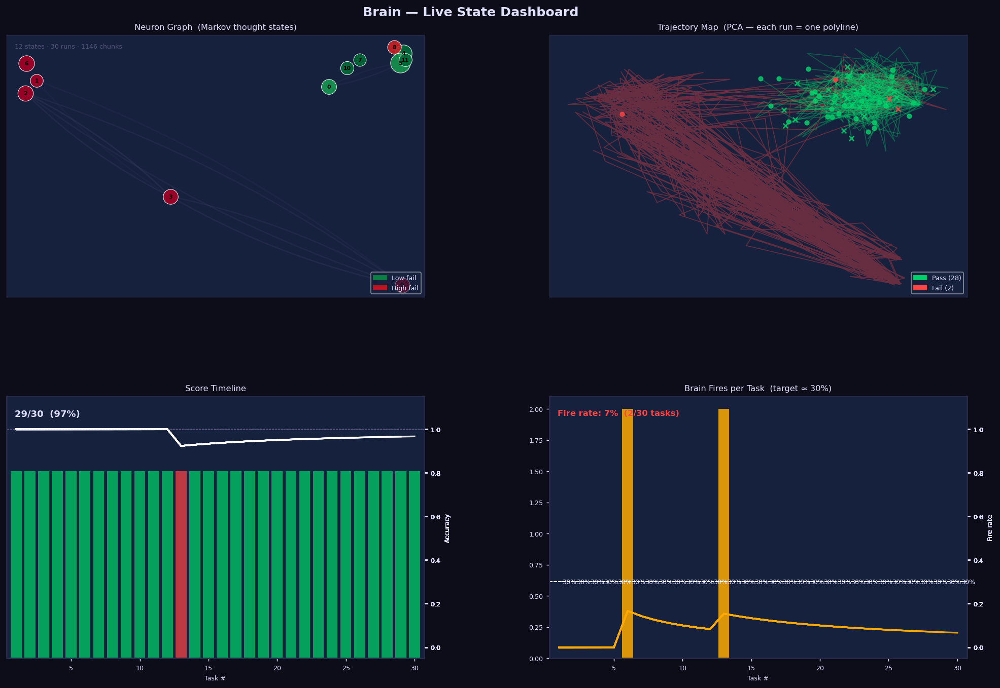
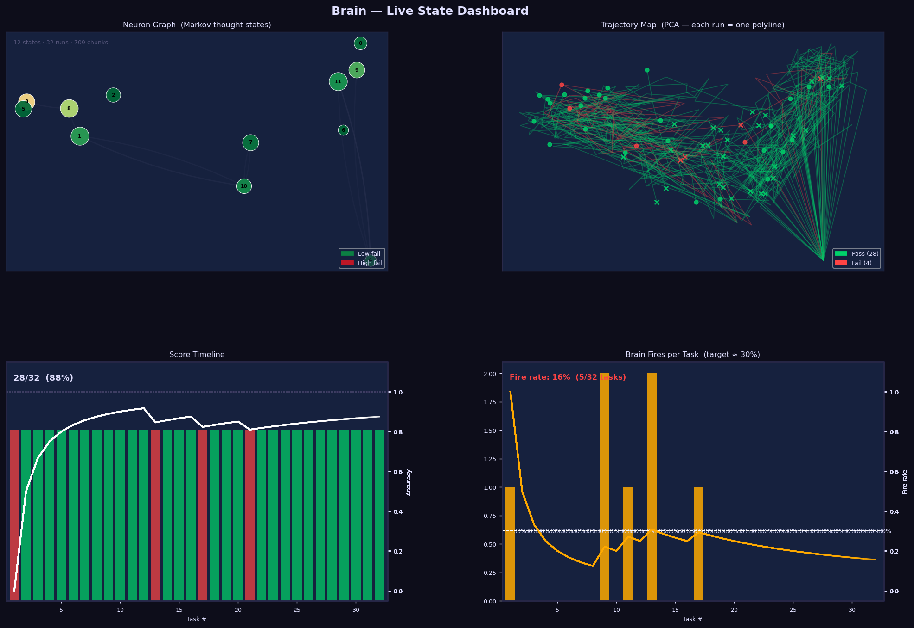
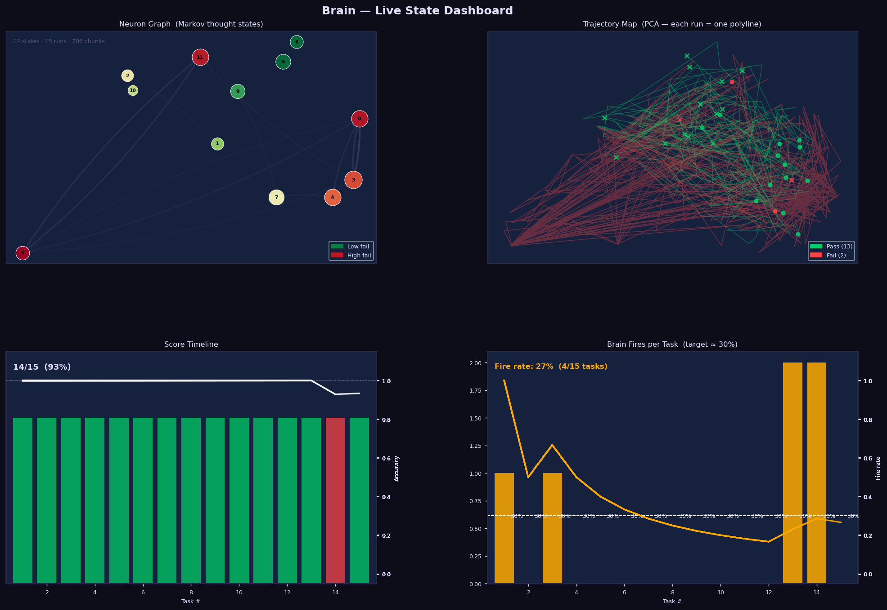

# trace_use

[](https://pypi.org/project/trace-use/)
[](https://pypi.org/project/trace-use/)

**Learn failure patterns from LLM agent traces and intercept recurrences before they execute.**

`trace_use` is a self-contained Python toolkit that monitors tool-use LLM agents in real time, extracts reusable logical failure motifs from past errors, and fires corrective interventions before the same mistake can execute again — with zero false positives on held-out near-miss tasks.

---

## The problem

LLM agents fail in systematic, repeatable ways. The same logical mistake — retry all exceptions instead of selective ones, sort on a single key when a tiebreak is required, return a default value instead of raising an error — recurs across different tasks with different surface code. Every time it recurs, the standard flow is:

1. Agent generates code with the same underlying logical error
2. Code executes and produces wrong output
3. Agent reads the wrong output, reasons about what went wrong, generates a corrected version
4. Corrected code executes — task passes or fails again

Each of those cycles costs tokens, latency, and sometimes propagates incorrect results downstream before anyone notices. Nothing prevents the mistake from happening on the next task.

---

## The critical idea

**Don't predict failure from what a trace looks like. Extract the logical principle behind each failure and require concrete proof that the exact logical gap is present before firing.**

When a task fails, the brain makes a single background LLM call to extract *why* — not what the code looked like, but what logical requirement was violated. This produces a `FailureMotif`:

```
required_condition:  "task requires selective retry based on error type"
violation_condition: "except Exception catches all types without a type check"
recommendation:      "check exception type or .status_code before deciding to retry"
```

On every subsequent task, before the agent's `python_exec` call, the brain retrieves candidate motifs by embedding similarity, then asks an LLM judge one question: *can you find exact text in this task satisfying the required condition, and an exact line in this code matching the violation condition?* If both are concretely grounded in the actual text, the brain fires before execution. If either is absent, it stays silent.

The fire happens before the bad code runs. The agent never executes it, never reads wrong output, and never spends a turn diagnosing the error. It receives a targeted correction naming the exact requirement and the exact line at fault, and corrects in the next turn.

---

## What is novel

**From similarity scoring to logical proof.** Prior approaches — including earlier versions of this library — used embedding kNN over stored traces to produce a numeric p_fail score. High trajectory similarity to past failures triggered intervention. This fails in practice because semantic similarity does not imply logical equivalence. A finance task and a sorting task can have nearly identical reasoning embeddings but completely unrelated failure modes. A retry motif would fire on a sort task simply because both involve loops and conditions — a false positive that erodes trust in the system.

Our approach makes cross-domain contamination structurally impossible. A retry motif cannot fire on a sort task because you cannot find "retry" or "error type" in a sort task's text. The requirement quote must be a substring of — or have ≥70% word overlap with — the actual task description or reasoning. This is not a threshold to tune; it is a logical predicate that either holds or does not.

**Abstraction over examples.** We do not store raw traces and compare them. We extract an abstract logical principle from a single failure, generalised away from variable names, field names, and domain-specific constants. One failure on a task called `retry_request` produced a motif that fired correctly on `retry_on_type` and `safe_request` two and four tasks later — different prompts, different exception types, different code structure — because the motif encodes *why* the code was wrong, not what it looked like.

**Pre-execution interception.** The intervention fires before the tool executes, not after reading the wrong result. This eliminates the failed-execution → error-analysis → retry loop entirely rather than shortening it.

**Trajectory as evidence, not trigger.** The accumulated reasoning trace — what the agent was thinking before each tool call — is passed to the judge as grounding context for the quotes. It contributes to firing only when it contains concrete evidence of the logical gap. It is never scored numerically or compared against stored trajectories.

**Deterministic validation as a false-positive firewall.** Even when the LLM judge returns `applies: true`, the brain does not fire unless a separate deterministic check (`_validate_judge_result`) passes. That check requires: confidence ≥ 0.80, both quotes non-empty, recommendation ≥ 10 characters, no speculative language in either quote (`"likely"`, `"task implies"`, `"might"`, `"probably"`, etc.), and both quotes grounded in the actual task/code/reasoning text. This two-stage design — LLM judge for recall, deterministic gate for precision — is what produces 0% false positives on held-out near-miss tasks while still catching real recurrences.

---

## The Brain (`brain.py`)

`BrainAgent` attaches to a tool-use agent and runs two independent detection paths: a **stall detector** that fires immediately from task 1 with no stored history, and a **learned-motif store** that fires after the first occurrence of a failure class has been extracted.

### Architecture

```
BrainAgent
├── push(text)
│   └── accumulates live reasoning text from the agent's streaming output
│
├── before_tool_call(name, input_dict)  ← fires BEFORE code executes
│   ├── retrieve candidate motifs (embedding cosine similarity ≥ 0.35, top_k=4)
│   ├── for each candidate motif:
│   │   ├── call applicability judge  (Haiku; structured JSON; max_tokens=320)
│   │   └── validate deterministically (_validate_judge_result, threshold=0.80)
│   └── if any motif passes both → return STOP/FIX message; else return None
│
├── on_tool_call(name, input_dict, result)  ← fires AFTER execution
│   └── stall detection: ≥2 consecutive unproductive calls → redirect message
│
└── store(trace, label, metadata="")
    └── label=0: extract one FailureMotif in a background thread (non-blocking)
        ├── if motif is new → add to MotifStore with embedding
        └── if motif matches existing (via update_id) → update and re-embed
```

### Stall detection

When the agent makes two or more consecutive `python_exec` calls with empty code or empty output, the brain injects a hard redirect as part of the tool result:

```
[BRAIN — STALL after 2 unproductive calls]
Stop repeating the same empty call. Try a completely different approach.
```

This requires no stored history and works from the very first task in a session.

### Learned-motif detection

**Extraction (on failure).** When `store(trace, 0, metadata="reason")` is called, the brain spawns a background thread that makes one Haiku call with the failed code, the task description, the agent's reasoning, and a list of existing motifs shown for deduplication. The LLM returns either a new motif or an `update_id` pointing to an existing one it recognises as the same underlying bug. If it returns `update_id`, the existing motif is updated and re-embedded rather than duplicated.

The extraction prompt enforces generalisation: no variable names, no field names, no domain-specific constants. The `required_condition` must describe what the *task* must say; the `violation_condition` must describe what the *code or reasoning* must show. A motif that names a specific variable (`"users list missing tiebreak"`) is rejected — only logical predicates that transfer across domains are stored.

**Detection (before execution).** On each `python_exec` call, the brain:

1. Embeds a query combining the current task, recent reasoning, and proposed code
2. Retrieves candidate motifs with cosine similarity ≥ 0.35 (high recall, low threshold — the judge handles precision)
3. For each candidate, calls the applicability judge:

```json
{
  "applies": true,
  "confidence": 0.92,
  "requirement_quote": "Only retry exceptions listed in retry_on.",
  "violation_quote": "except Exception as e:",
  "explanation": "code retries all exceptions instead of checking type",
  "recommendation": "check type(e).__name__ in retry_on before retrying"
}
```

4. Validates deterministically — all of the following must hold:
   - `applies: true` and `confidence ≥ 0.80`
   - `requirement_quote` non-empty and grounded in task or reasoning text
   - `violation_quote` non-empty and grounded in code or reasoning text
   - `recommendation` ≥ 10 characters
   - Neither quote contains speculative language: `"task implies"`, `"likely"`, `"might"`, `"possibly"`, `"probably"`, `"similar to"`, `"should consider"`, `"could fail"`, `"general requirement"`, `"perhaps"`, `"seems like"`

5. Fires if and only if validation passes:

```
⚠️ BRAIN:
STOP: The monitor detected a likely logical failure before execution.

Evidence (Learned pattern: Non-Selective Retry Catches All Exception Types):
  - Requirement: Only retry exceptions listed in retry_on.
  - Violation:   except Exception as e:
  - Explanation: code retries all exceptions instead of checking type

Required correction:
  check type(e).__name__ in retry_on before retrying

Revise the code before calling the tool again.
```

The agent reads this as the tool result and corrects before executing — no wasted call, no failed output to parse.

### `BrainAgent` public API

| Method / property | Description |
|---|---|
| `BrainAgent(embedder, k=4, threshold=0.80)` | Initialise with an embedder callable, candidate count, and minimum judge confidence |
| `brain.set_task(idx, task="")` | Register the current task index and task description string; description is passed to the judge and extraction prompt for grounding |
| `brain.reset()` | Clear reasoning buffer, intervention counter, and stall streak before a new task |
| `brain.push(text)` | Accumulate a reasoning chunk; called automatically by `tool_agent` when `agent.monitor = brain` is set |
| `brain.before_tool_call(name, input_dict)` | Pre-execution hook — returns a STOP string or `None`; called automatically by `tool_agent` |
| `brain.on_tool_call(name, input_dict, result)` | Post-execution hook — stall detection; returns modified result string or `None`; called automatically |
| `brain.store(trace, label, metadata="")` | Store a completed run. On `label=0`, spawns background motif extraction. Pass the failure reason as `metadata` — it is the primary input to the extraction prompt |
| `brain.n_stored` | Number of learned motifs currently in the store |
| `brain.last_fire` | `dict` with `task`, `motif`, `confidence`, `requirement_quote`, `violation_quote` from the most recent fire; `None` if no fire this session |

### Storage invariant

Always store the **first-attempt trace** with the **first-attempt label**. When the brain fires and the agent corrects and passes on a retry, store the *original failing trace with label 0*, not the corrected trace with label 1. Storing recovery traces conflates correction patterns with failure patterns and degrades motif quality.

---

## How to use

### Install

```bash
pip install trace-use
```

Or from source (recommended for running evals or modifying the library):

```bash
git clone https://github.com/Rumbl3S/Trace-Optimization.git
cd Trace-Optimization
pip install -e .
```

Set API keys (drop a `.env` file at your project root or export directly):

```bash
export ANTHROPIC_API_KEY=sk-ant-...
export OPENAI_API_KEY=sk-...      # only needed if sentence-transformers is unavailable
```

Verify the offline test suite:

```bash
pytest tests/ -q     # 188 tests, ~1.5s, no API key needed
```

---

### Minimal setup — any task loop in 5 minutes

No configuration beyond the API key. The brain starts cold and learns from whatever failures occur naturally:

```python
from trace_use import BrainAgent, build_embedder, tool_agent

embedder      = build_embedder()    # uses local sentence-transformers; falls back to OpenAI
brain         = BrainAgent(embedder, k=4, threshold=0.80)
agent         = tool_agent(["python_exec"], max_turns=8, model="claude-haiku-4-5-20251001")
agent.monitor = brain               # all hooks (push, before_tool_call, on_tool_call) attach automatically

for i, task in enumerate(my_tasks):
    brain.set_task(i, task=task["prompt"])  # gives the judge a grounding context
    brain.reset()                           # clears reasoning buffer and stall counter

    trace, tokens = agent(task["prompt"])
    passed        = my_verifier(trace)      # your existing pass/fail logic

    # IMPORTANT: store the first-attempt trace with the first-attempt label.
    # If the brain fires and the agent corrects mid-turn, this trace is still
    # the first attempt — store it with the original label.
    brain.store(trace, int(passed), metadata="description of what went wrong" if not passed else "")

print(f"Motifs learned: {brain.n_stored}")
```

The brain begins intercepting recurrences immediately after the first failure is stored. There is no warm-up period — a single stored failure is enough.

---

### Checking what the brain did

After each task, inspect the fire record:

```python
if brain.last_fire:
    print(f"  Motif:       {brain.last_fire['motif']}")
    print(f"  Confidence:  {brain.last_fire['confidence']:.2f}")
    print(f"  Requirement: {brain.last_fire['requirement_quote']}")
    print(f"  Violation:   {brain.last_fire['violation_quote']}")
```

At the end of a session:

```python
print(f"Total motifs learned: {brain.n_stored}")
for motif in brain._motif_store.motifs:
    print(f"  [{motif.id}] {motif.name}")
    print(f"    requires: {motif.required_condition}")
    print(f"    detects:  {motif.violation_condition}")
```

---

### Full session example with result tracking

```python
from trace_use import BrainAgent, build_embedder, tool_agent
import time

embedder      = build_embedder()
brain         = BrainAgent(embedder, k=4, threshold=0.80)
agent         = tool_agent(["python_exec"], max_turns=8, model="claude-haiku-4-5-20251001")
agent.monitor = brain

results = []

for i, task in enumerate(my_tasks):
    brain.set_task(i, task=task["prompt"])
    brain.reset()
    t0 = time.time()

    trace, tokens = agent(task["prompt"])
    elapsed       = time.time() - t0
    passed        = my_verifier(trace)
    fired         = brain.last_fire is not None

    status = "PASS [FIRED]" if passed and fired else "PASS" if passed else "FAIL [FIRED]" if fired else "FAIL"
    print(f"[{i+1:02d}] {task['name']:<35} | {status:<12} | {elapsed:.1f}s | {tokens:,} tok")

    brain.store(trace, int(passed), metadata=task.get("expected_failure", ""))
    results.append({"name": task["name"], "passed": passed, "fired": fired, "tokens": tokens})

pass_rate = sum(r["passed"] for r in results) / len(results)
fire_rate = sum(r["fired"] for r in results) / len(results)
print(f"\nPass rate: {pass_rate:.1%}  |  Fire rate: {fire_rate:.1%}  |  Motifs: {brain.n_stored}")
```

---

### Providing failure metadata

The `metadata` argument to `brain.store()` is the primary signal for motif extraction. It is passed directly to the extraction prompt as the "failure reason." The more specific it is, the better the extracted motif generalises.

```python
# good — tells the extractor what logical rule was violated
brain.store(trace, 0, metadata="400 errors should not be retried; only 5xx should")

# also good — describes the observable wrong behaviour
brain.store(trace, 0, metadata="code returned None instead of raising ValueError on missing key")

# too vague — extractor has little to work with
brain.store(trace, 0, metadata="wrong")
```

If you use a programmatic verifier, you often know the specific failure reason from the failing assertion — pass that string directly.

---

### Using with a custom verifier

```python
def my_verifier(trace: str) -> tuple[bool, str]:
    """Returns (passed, failure_reason)."""
    code = extract_code_from_trace(trace)   # your parsing logic
    ns   = {}
    exec(code, ns)
    fn = ns.get("process_items")
    if fn is None:
        return False, "process_items function not defined"
    try:
        result = fn([1, 2, None, 3])
        if None in result:
            return False, "function should filter None values, not pass them through"
        return True, ""
    except Exception as e:
        return False, f"raised {type(e).__name__}: {e}"

for i, task in enumerate(tasks):
    brain.set_task(i, task=task["prompt"])
    brain.reset()
    trace, _ = agent(task["prompt"])
    passed, reason = my_verifier(trace)
    brain.store(trace, int(passed), metadata=reason)
```

---

### Threshold and retrieval tuning

The default `threshold=0.80` sets the minimum judge confidence required to fire. Lower values allow fires at lower confidence; higher values require near-certainty.

```python
brain = BrainAgent(embedder, k=4, threshold=0.80)   # default — recommended starting point
brain = BrainAgent(embedder, k=4, threshold=0.70)   # slightly more permissive
brain = BrainAgent(embedder, k=4, threshold=0.90)   # fires only on very high-confidence matches
```

`k=4` controls how many candidate motifs are retrieved per call. Each retrieved motif triggers one Haiku call, so raising k increases latency linearly. With a small motif store (< 10 motifs), the 0.35 similarity floor naturally limits candidates regardless of k.

---

## The Forecaster (`pipeline.py`)

`Forecaster` operates after task completion. It embeds full traces, stores them with labels, and predicts P(fail) for new traces via kNN. Use it to decide whether to retry a completed task before accepting the result.

### Quickstart

```python
from trace_use import haiku, opus, build_embedder, run_task, self_judge, Forecaster

embedder   = build_embedder()
forecaster = Forecaster(embedder)
verifier   = self_judge(judge_agent=opus)   # always use a different model than the one being judged

result = run_task(
    task       = "Explain the CAP theorem and name all three properties.",
    agent      = haiku,
    verifier   = verifier,
    forecaster = forecaster,
    retry      = True,
)
print(result.summary())
```

### With a tool-use agent

```python
from trace_use import tool_agent, build_embedder, run_task, code_judge, Forecaster

agent = tool_agent(["python_exec"], max_turns=6)
fc    = Forecaster(build_embedder())

def check(namespace: dict, stdout: str) -> bool:
    fn = namespace.get("binary_search")
    return fn and fn([1,3,5,7,9], 5) == 2 and fn([1,3,5,7,9], 9) == 4

result = run_task(
    task       = "Fix the off-by-one in this binary search: ...",
    agent      = agent,
    verifier   = code_judge(check),
    forecaster = fc,
    retry      = True,
)
```

### `Forecaster` API

| Method / property | Description |
|---|---|
| `fc.fit(traces, labels)` | Bulk-load trace strings and int labels |
| `fc.add(trace, label)` | Add one trace online after a task completes |
| `fc.predict_fail(trace)` | `float` in `[0,1]` — P(this trace fails) |
| `fc.should_intervene(trace)` | `bool` — uses adaptive threshold |
| `fc.explain(trace, k=3)` | Nearest stored traces with similarity, label, and excerpt |
| `fc.adaptive_threshold` | Auto-computed: `fail_rate + (1 − fail_rate) × 0.20` |

Cold-start: predictions become reliable at approximately **50 traces** with a mix of passes and failures.

---

## Trace signal quality

*How* an agent reasons predicts failure independently of whether the final answer looks wrong. Reasoning-only AUC on structured multi-hop tasks reaches **0.84** — wrong reasoning paths diverge from correct ones in embedding space well before the final answer token. The signal transfers to task types never seen before (leave-one-out AUC 0.61–0.73).

| Agent type | Signal quality | Why |
|---|---|---|
| Tool-use agent (`python_exec`, search) | High (AUC 0.87) | Tool call sequences differ structurally; correct traces show clean execution, failing traces show wrong output or repeated attempts |
| Text agent with CoT | Moderate (AUC 0.68) | Wrong reasoning produces wrong intermediate values; a forced step-by-step output creates discriminating structure |
| One-liner text agent | Near chance | `"Paris"` and `"Lyon"` produce near-identical embeddings |

**Practical rule:** force multi-step output. A CoT wrapper adds signal to any text-only agent:

```python
def cot_agent(prompt: str):
    return haiku(
        prompt + "\n\nThink step by step, showing every intermediate result. "
        "End with 'ANSWER: ...'."
    )
```

---

## Results

### Summary across all evaluations

| Eval | Model | Tasks | Baseline | +Brain | Brain contribution |
|---|---|---|---|---|---|
| Multi-hop QA (FanOutQA + MuSiQue) | Haiku | component | — | AUC **0.85** | — |
| Python debugging (`demo_debug.py`) | Haiku | 29 | — | AUC **0.87** | — |
| Diverse everyday tasks (`demo_general.py`) | Haiku | 40 | — | AUC **0.68** | — |
| 30 diverse domains (`eval_fires`) | Haiku | 30 | 27/30 (90%) | 28/30 (93%) | +1 task, 5 fires |
| Hard code + text (`eval_hard`) | **Sonnet** | 14 | 12/14 (86%) | 13/14 (93%) | +1 task, 1 fire |
| 30-task intensive (`eval_haiku_intensive`) | Haiku | 30 | 26/30 (87%) | 27/30 (90%) | +2 tasks, 2 fires |
| Real-world hard tasks (`eval_real_world`) | Haiku | 30 | 28/30 (93%) | 29/30 (97%) | +1 task, 2 fires |
| Extensive benchmark (`eval_extensive`) | Haiku | 32 | 28/32 (88%) | 28/32 (88%) | 0 tasks, 5 fires |
| **Portfolio Risk Analyzer (`eval_project`)** | **Haiku** | **15** | **13/15 (87%)** | **14/15 (93%)** | **+1 task, 4 fires** |
| **Cold-start learning (`eval_dev_learning`)** | **Haiku** | **56** | **43/56 (77%)** | **45/56 (80%)** | **+2 tasks, 2 fires; 0% FP on 16 near-miss tasks** |

---

### Multi-hop QA — per-component forecasting

Decomposing tasks into atomic sub-questions and forecasting each independently raised AUC from ~0.45 (chance, whole-task labels) to **0.85** on structured multi-hop QA (FanOutQA + MuSiQue).

| Metric | Value |
|---|---|
| Per-component failure AUC | **0.85** |
| Reasoning-only AUC (no answer text) | **0.84** |
| Failures caught at 20% verify budget | **31%** (1.56× random baseline) |
| Budget to catch 80% of failures | 58–68% of components |
| Leave-one-task-type-out AUC | **0.61–0.73** (zero-shot transfer) |

---

### Hard one-shot failures — Sonnet + Brain (`eval/eval_hard.py`)

14 tasks where Sonnet reliably fails in one shot: 7 hard algorithm tasks (LRU cache, sliding window max, histogram largest rectangle, regex matching, thread-safe bank, burst balloons, Trie) and 7 physics/probability text problems (Bayesian base-rate neglect, rolling sphere inertia, twin paradox, hydrogen emission, buoyancy paradox, Simpson's paradox, Bertrand box).

| | Baseline | +Brain |
|---|---|---|
| Code tasks (7) | 6/7 | **7/7** |
| Text tasks (7) | 6/7 | 6/7 |
| **Overall** | **12/14 (86%)** | **13/14 (93%)** |

Brain fixed the histogram (largest rectangle) task — Sonnet's first implementation used a naive O(n²) approach that produced wrong results on edge cases. The probe caught it in one fire.



---

### Real-world hard tasks — 30 tasks (`eval/eval_real_world.py`)

Tasks drawn from confirmed LLM failure modes in competitive programming and GPQA Diamond research: segment tree with lazy propagation, KMP with overlapping matches, LIS O(n log n), Bellman-Ford with negative cycle detection, Graham scan convex hull, matrix chain multiplication, sliding window median, Manacher's palindrome — and 15 graduate-level science and combinatorics problems (Nernst equation, Compton scattering, de Broglie wavelength, Henderson-Hasselbalch, Michaelis-Menten, CRT, Stirling numbers, derangements).

| | Baseline | +Brain |
|---|---|---|
| Code (15 tasks) | 13/15 (87%) | **14/15 (93%)** |
| Text (15 tasks) | 15/15 (100%) | 15/15 (100%) |
| **Overall** | **28/30 (93%)** | **29/30 (97%)** |

The brain fixed the Graham scan convex hull — haiku's first implementation failed edge-case tests (collinear point handling and interior point exclusion). The probe fired twice; haiku corrected both issues in subsequent turns.



---

### Extensive hard-task benchmark — 32 tasks (`eval/eval_extensive.py`)

32 tasks drawn from competitive programming (LiveCodeBench Pro / ICPC-Eval difficulty) and GPQA-style science: lazy-propagation segment tree, bitmask TSP, matrix exponentiation, digit DP, Manacher's, minimum window substring, lexicographic topological sort, Kruskal's MST, plus Python debugging traps and 12 physics/math problems.

| | Baseline | +Brain |
|---|---|---|
| Code (20 tasks) | 17/20 (85%) | 17/20 (85%) |
| Text (12 tasks) | 11/12 (92%) | 11/12 (92%) |
| **Overall** | **28/32 (88%)** | **28/32 (88%)** |

Brain fired on 5 tasks; none were fixed. This illustrates the brain's ceiling: when a task fails because the entire algorithm approach is wrong, motif-based feedback cannot recover it. The brain's value is highest when errors are localized — a formula sign, a boundary condition, a missed edge case — not when the approach itself needs rethinking.



---

### Day-in-the-life project eval — Portfolio Risk Analyzer (`eval/eval_project.py`)

15 sequential tasks that together build a complete stock portfolio risk analyzer from scratch. Each task builds on the previous — bugs in early tasks propagate downstream silently.

| # | Task | First attempt | +Brain |
|---|---|---|---|
| 1 | Simulate correlated stock prices (GBM + Cholesky) | ✓ | ✓ ⚡×1 |
| 2 | Compute log daily returns | ✓ | ✓ |
| 3 | Rolling 20-day statistics (mean, vol, skew) | **✗** | **✓ ⚡×1 ↑FIXED** |
| 4 | Annualised covariance matrix | ✓ | ✓ |
| 5 | Minimum variance portfolio (scipy.optimize) | ✓ | ✓ |
| 6 | Maximum Sharpe ratio (tangency portfolio) | ✓ | ✓ |
| 7 | 1-day 95% Value at Risk (historical) | ✓ | ✓ |
| 8 | Conditional VaR / Expected Shortfall | ✓ | ✓ |
| 9 | Maximum drawdown | ✓ | ✓ |
| 10 | Annualised Sharpe ratio | ✓ | ✓ |
| 11 | Portfolio beta to market | ✓ | ✓ |
| 12 | Risk contribution (marginal to portfolio variance) | ✓ | ✓ |
| 13 | Stress test: apply shock scenarios | ✓ | ✓ ⚡×2 |
| 14 | Monthly rebalancing with transaction costs | **✗** | **✗** ⚡×2 |
| 15 | Full portfolio risk report | ✓ | ✓ |

**Overall: 13/15 (87%) baseline → 14/15 (93%) with brain.**

Haiku's rolling statistics implementation computed `returns.rolling(window).mean().std()` — standard deviation of rolling averages — instead of `returns.rolling(window).std()`, rolling standard deviation. These are not the same: the former smooths variation before measuring it, systematically underestimating volatility. Without this catch at Task 3, the covariance matrix, Sharpe ratio, and final risk report would all have been built on wrong volatility estimates. Early interception prevents silent error propagation downstream.



---

### Cold-start learning benchmark — 56 developer tasks (`eval/eval_dev_learning.py`)

The most targeted test of the motif-learning system. 56 tasks across 8 programming families, structured so the brain must learn from first occurrences and prevent recurrences — starting cold with zero stored history.

**Structure:** 8 families × 7 tasks each
- 1 discovery task per family (cold start — no stored motifs)
- 4 recurrence tasks per family (brain may fire if motif was learned)
- 2 near-miss tasks per family (same domain, no actual bug — brain must stay silent)

**Families:** `nested_key`, `shared_state`, `off_by_one`, `unit_scale`, `secondary_sort`, `api_key`, `validation_all_errors`, `retry_classification`

| Metric | Value |
|---|---|
| Overall pass rate | **87.5%** (49/56) |
| Discovery failure rate | 25.0% (2/8 families failed their first task) |
| Motif extraction rate | **100%** (2/2 failed families produced a motif) |
| Repeat prevention — retry_classification | **50%** (2/4 recurrences caught and fixed) |
| False positive rate on near-miss tasks | **0%** (0/16) |
| Total tokens | 165,426 (~2,954/task) |
| Total time | 450s (~8.0s/task) |

**Motifs learned and their reach:**

| Motif | Learned from | Recurrences caught | Notes |
|---|---|---|---|
| `retry_on_all_errors_not_selective` | task 8 | **2/4** | Fired on `retry_on_type` and `safe_request` — different prompts, same logic error |
| `silent_failure_instead_of_exception` | task 3 | 0/3 | Correctly silent — api_key recurrences failed for a different reason (key mapping), not ValueError |

**Cost comparison — with vs. without brain:**

Methodology: task 16 took 23.6s with brain intervention; task 32 took 28.3s. Without brain, each would have executed bad retry code (~3s of incorrect retry loops), then required one extra Haiku turn to analyze the wrong output and generate a fix (~5s, ~900 tokens). Reference: task 8 (same family, discovery failure) ran 4 wasted retry attempts before failing at 7.2s.

| | Task 16 (`retry_on_type`) | Task 32 (`safe_request`) | Total (2 fires) |
|---|---|---|---|
| Time with brain | 23.6s | 28.3s | 51.9s |
| Time without brain (est.) | **31.6s** (+8s) | **36.3s** (+8s) | **67.9s** (+16s) |
| Extra tokens without brain (est.) | **+900** | **+900** | **+1,800** |
| Extra LLM turns without brain | +1 | +1 | +2 |

**This benchmark:** brain saved ~1,800 tokens and ~16 seconds across 56 tasks. At 200-task scale (same ~3.6% prevention rate → 7 fires): **~6,300 tokens and ~56 seconds** avoided from needless failure-and-recovery loops.

**False positive rate:**

The brain was tested against 16 near-miss tasks — same programming families, same vocabulary, no actual bug present. It fired zero times. The structured proof requirement (both quotes must be grounded in actual task/code text, no speculative language) prevented cross-domain contamination entirely.

---

## Verifiers (`pipeline.py`)

The only task-specific input to the pipeline is a `Verifier`: `(question, answer) -> float` in `[0, 1]`.

| Verifier | When to use |
|---|---|
| `code_judge(check_fn)` | Programmatic — exec the code and run your assertions |
| `gold_judge(gold, agent)` | Ground-truth string available |
| `self_judge(judge_agent)` | No ground truth — use a different model to grade |
| `tiered_judge(fast, strong)` | Save cost — fast model on easy cases, strong on uncertain |
| `self_consistency(resample, samples)` | No judge — re-run and check agreement |

```python
def check(ns: dict, stdout: str) -> bool:
    fn = ns.get("min_variance_portfolio")
    if not fn: return False
    import numpy as np
    cov = np.diag([0.04, 0.16])
    r = fn(cov)
    w = np.array(r["weights"]).flatten()
    return abs(sum(w) - 1.0) < 0.01 and w[0] > 0.5

verifier = code_judge(check)
```

---

## `run_task` reference

```python
run_task(
    task            = "...",       # task string
    agent           = haiku,       # callable: prompt -> text or (text, tokens)
    verifier        = verifier,    # callable: (q, trace) -> float
    forecaster      = fc,          # Forecaster instance (optional)
    retriever       = retriever,   # context retriever (optional)
    threshold       = None,        # override adaptive threshold (optional)
    cap             = 8,           # max sub-questions from decompose
    display         = True,        # Rich live terminal output
    retry           = True,        # fire self-critique retry on high P(fail)
    retry_agent     = None,        # different agent for retries
    decompose_agent = None,        # different agent for decomposition
)
```

Returns a `TaskResult` with `.n_pass`, `.n_fail`, `.n_intervened`, `.summary()`, and per-component `.components`.

---

## Demos

```bash
# AUC / forecasting demos
python demo_general.py          # 40 diverse tasks, CoT haiku, AUC ~0.68
python demo_debug.py            # 29 Python debugging tasks, tool agent, AUC ~0.87
python demo_large.py            # 80+ mixed tasks, full Rich display

# brain interception evals
python eval/eval_dev_learning.py          # 56-task cold-start motif learning benchmark
python eval/eval_fires.py                 # 30 diverse domains, haiku
python eval/eval_hard.py                  # 14 hard one-shot failures, Sonnet
python eval/eval_haiku_intensive.py       # 30 tasks, haiku, intensive
python eval/eval_real_world.py            # 30 hard tasks (segment tree, GPQA-style)
python eval/eval_extensive.py             # 32 tasks, LiveCodeBench Pro / ICPC-Eval difficulty
python eval/eval_project.py               # 15-task portfolio analyzer session
```

---

## Embedder

`build_embedder()` in `agents.py` prefers local and falls back to remote:

1. **`sentence-transformers` (preferred):** `all-MiniLM-L6-v2`, 384-dim, free, ~10ms/chunk on CPU, no API key required
2. **OpenAI `text-embedding-3-small`:** 1536-dim, requires `OPENAI_API_KEY`

Both return L2-normalised `float32` vectors and are drop-in interchangeable. The local option is recommended — it adds no latency cost and no per-call API expense.

---

## Repo layout

| Path | Role |
|---|---|
| `trace_use/pipeline.py` | Public API: `run_task`, `decompose`, `attempt`, `Forecaster`, `make_retriever`, all verifiers |
| `trace_use/brain.py` | `BrainAgent`, `MotifStore`, `FailureMotif`, `_validate_judge_result` — inference-time learned-motif detection |
| `trace_use/forecast.py` | Primitives: `knn_predict`, `knn_predict_cross`, `auc`, `spearman` |
| `trace_use/display.py` | Rich live terminal display used by `run_task` |
| `trace_use/agents.py` | `haiku`, `opus`, `tool_agent`, `build_embedder`, `_anthropic_call` (lazy clients, keys from env/`.env`) |
| `demo_general.py` | 40 diverse tasks, CoT haiku, live plot, AUC ~0.68 |
| `demo_debug.py` | 29 Python debugging tasks, tool agent, AUC ~0.87 |
| `demo_large.py` | 80+ mixed tasks, full Rich display |
| `bench/` | Vendored benchmark loaders (FanOutQA, MuSiQue) |
| `eval/eval_dev_learning.py` | 56-task cold-start motif learning benchmark |
| `eval/eval_fires.py` | 30-task brain eval, diverse domains |
| `eval/eval_hard.py` | 14 hard one-shot failures, Sonnet + Haiku |
| `eval/eval_haiku_intensive.py` | 30-task intensive haiku session |
| `eval/eval_real_world.py` | 30 hard tasks: competitive programming + GPQA-style science |
| `eval/eval_extensive.py` | 32 tasks: LiveCodeBench Pro / ICPC-Eval difficulty |
| `eval/eval_project.py` | 15-task portfolio risk analyzer |
| `eval/results/` | Saved charts and JSON run logs |
| `tests/` | Offline test suite: `test_forecast.py`, `test_pipeline.py`, `test_brain.py` (188 tests, ~1.5s, no API key) |

---

## Limitations

- **Motifs need a discovery failure to activate.** The brain cannot prevent the first occurrence of a failure class — only recurrences. If you know a specific failure mode in advance, write a programmatic verifier that returns the exact failure reason as metadata; this accelerates extraction.
- **Retrieval adds latency when the store is non-empty.** With a 10-motif store, `before_tool_call` makes 1–3 Haiku judge calls (~300–600ms total). This is acceptable for tasks where each agent turn already takes 3–8 seconds, but is noticeable at sub-second latency targets.
- **Motif quality depends on failure metadata.** Vague metadata (`"wrong"`, `"failed"`) produces vague motifs that fail to generalise. The more specific the failure reason passed to `brain.store()`, the more precise and transferable the extracted motif.
- **Trace richness is required.** One-liner responses produce near-identical embeddings for correct and incorrect answers. The brain's judge relies on reasoning text being available via `push()`. Use a tool-calling agent or wrap any text model in a CoT prompt that forces step-by-step output.
- **Verifier quality sets the ceiling.** Mislabeled traces produce mislabeled motifs. A motif extracted from a task incorrectly marked as failed will fire on correct code. Prefer programmatic checks; when using an LLM judge, always use a different model than the one being evaluated.
- **Brain is most impactful in the 15–40% failure band.** Above ~90% pass rate, fires are rare and marginal gains are small. Below ~60%, the model may need a fundamentally different approach rather than mid-turn correction.

---

## Negative results

These are documented findings, not omissions.

- **GSM8K is too easy.** Haiku solves grade-school math at >95% first-attempt accuracy. No failure class accumulates enough recurrences for motif learning to matter.
- **Learned representations do not improve over raw embeddings** at this data scale. Fine-tuning embeddings on trace pairs did not improve AUC over `all-MiniLM-L6-v2` on 50–200 stored traces. The signal is in reasoning content, not a learned projection.
- **Intervention is failure-rate-dependent.** The brain adds value when there is a recurring failure class — a pattern appearing across 2+ tasks. On diverse benchmarks where each task fails for a different reason, the motif store grows but fires rarely.
- **Trajectory similarity scoring produces false positives.** Prior versions used embedding-based trajectory kNN (p_fail, Markov state tracking) to trigger interventions. These were removed: tasks with similar reasoning vocabulary (both involving "sorting" or "error handling") cross-contaminated — a sort task would fire on a retry motif. The structured proof requirement eliminates this class of error entirely.
